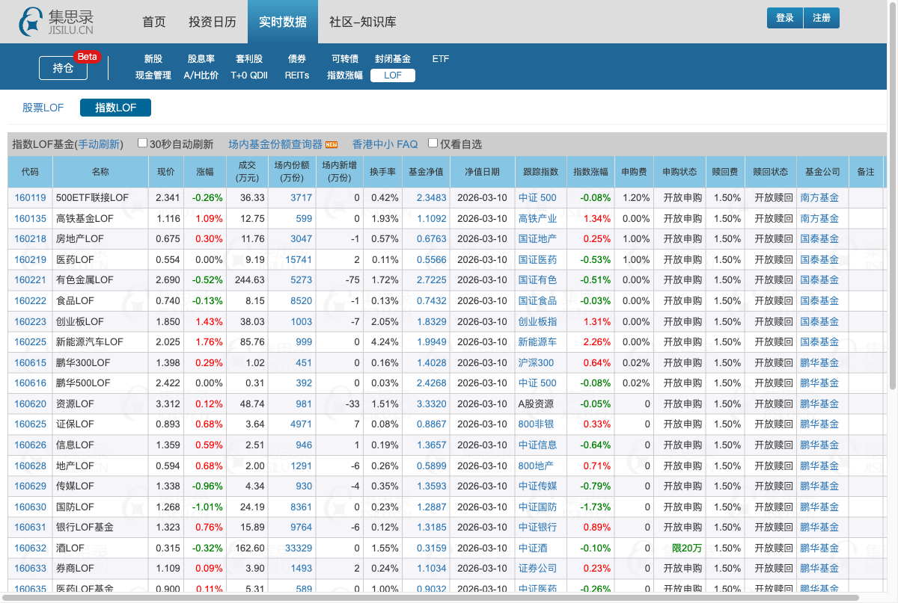

# Jisilu Premium Calculator

[English](README_EN.md) | 简体中文

[](https://opensource.org/licenses/MIT)
[](https://github.com/LogicDu/jisilu-premium-calculator/releases)
[](https://www.tampermonkey.net/)

一个用于集思录LOF/QDII基金页面的Tampermonkey脚本，可以自动计算并显示每只基金的溢价率，帮助投资者快速识别套利机会。



## ✨ 功能特性

- ✅ **自动添加溢价率列** - 在原有表格中无缝插入溢价率数据
- ✅ **实时估值功能** - 新增实时估值列，显示基金盘中实时估值（数据来源：天天基金网）
- ✅ **实时计算** - 根据场内价格和实时估值计算溢价率，更加准确
- ✅ **智能更新** - 支持手动刷新和自动刷新时同步更新数据
- ✅ **颜色标识** - 正溢价显示红色，负溢价显示绿色，一目了然
- ✅ **点击排序** - 支持点击表头按溢价率排序（降序→升序→取消）
- ✅ **多页面支持** - 支持LOF和QDII两个基金页面
- ✅ **表头悬浮** - 正确支持表头置顶悬浮显示
- ✅ **轻量高效** - 纯JavaScript实现，无外部依赖，不影响页面性能

## 📊 溢价率计算公式

```
溢价率 = (场内实时价 - 实时估值) / 实时估值 × 100%
```

**字段说明：**
- **场内实时价**：基金在二级市场的交易价格
- **实时估值**：基金盘中实时估值（数据来源：天天基金网）

**溢价率含义：**
- **正溢价（+）**：场内价格 > 实时估值，可能存在套利空间
- **负溢价（-）**：场内价格 < 实时估值，可能是买入机会

> 💡 **说明**：v1.4.0起，溢价率基于实时估值计算，而非T-1日净值。实时估值数据来源于天天基金网公开API，交易日9:30-15:00实时更新。

## 🚀 快速开始

### 安装步骤

1. **安装Tampermonkey扩展**
   - [Chrome/Edge](https://chrome.google.com/webstore/detail/tampermonkey/dhdgffkkebhmkfjojejmpbldmpobfkfo)
   - [Firefox](https://addons.mozilla.org/zh-CN/firefox/addon/tampermonkey/)
   - [Safari](https://www.tampermonkey.net/?browser=safari)

2. **安装脚本**
   
   点击下面的链接一键安装：
   
   👉 **[点击安装脚本](https://github.com/LogicDu/jisilu-premium-calculator/raw/main/src/jisilu-lof-premium.user.js)**

3. **开始使用**
   
   访问以下页面，脚本会自动添加溢价率列：
   - [集思录LOF页面](https://www.jisilu.cn/data/lof/#stock)
   - [集思录QDII页面](https://www.jisilu.cn/data/qdii/)

## 📁 项目结构

```
jisilu-premium-calculator/
├── src/
│   └── jisilu-lof-premium.user.js    # 主脚本文件
├── docs/
│   ├── screenshot.png                 # 效果截图
│   ├── method.jpg                     # 计算方法说明
│   ├── INSTALL.md                     # 安装指南
│   ├── DEVELOPMENT.md                 # 开发文档
│   └── FAQ.md                         # 常见问题
├── README.md                          # 项目说明（中文）
├── README_EN.md                       # 项目说明（英文）
├── LICENSE                            # MIT开源协议
├── CHANGELOG.md                       # 更新日志
├── CONTRIBUTING.md                    # 贡献指南
└── package.json                       # 项目配置
```

## 📖 文档

- 📘 [安装指南](docs/INSTALL.md) - 详细的安装步骤和配置说明
- 📗 [开发文档](docs/DEVELOPMENT.md) - 技术实现和API说明
- 📙 [常见问题](docs/FAQ.md) - 使用中的常见问题解答
- 📕 [更新日志](CHANGELOG.md) - 版本更新历史
- 📔 [贡献指南](CONTRIBUTING.md) - 如何参与项目贡献

## 🎨 自定义配置

编辑脚本可以自定义以下配置：

```javascript
const CONFIG = {
    COLUMN_NAME: '溢价率',           // 列名
    ESTIMATE_COLUMN_NAME: '实时估值', // 实时估值列名
    COLUMN_WIDTH: '80px',            // 列宽
    POSITIVE_COLOR: '#ff4444',       // 正溢价颜色（红色）
    NEGATIVE_COLOR: '#00aa00',       // 负溢价颜色（绿色）
    DECIMAL_PLACES: 2,               // 小数位数
    ESTIMATE_API: 'https://fundgz.1234567.com.cn/js/',  // 实时估值API
    CACHE_DURATION: 60000,           // 缓存时长（毫秒）
};
```

## 🔧 技术实现

- **DOM操作** - 动态添加表格列和数据
- **MutationObserver** - 监听表格变化，自动更新溢价率
- **数据解析** - 从页面元素中提取价格和净值数据
- **实时计算** - 使用精确的数学公式计算溢价率
- **排序功能** - 支持点击表头按溢价率排序
- **GM_xmlhttpRequest** - 绕过CORS限制获取第三方API数据

详细技术说明请查看 [开发文档](docs/DEVELOPMENT.md)

## 🌐 兼容性

| 浏览器 | 支持情况 |
|--------|----------|
| Chrome/Edge | ✅ 完全支持（推荐） |
| Firefox | ✅ 完全支持 |
| Safari | ✅ 完全支持 |
| 其他 | ⚠️ 需要Tampermonkey 4.0+ |

## 🌍 支持页面

| 页面 | URL | 状态 |
|------|-----|------|
| LOF基金 | https://www.jisilu.cn/data/lof/* | ✅ 支持 |
| QDII基金 | https://www.jisilu.cn/data/qdii/* | ✅ 支持 |

## ❓ 常见问题

<details>
<summary><strong>为什么有些基金显示"--"？</strong></summary>

可能的原因：
- 基金净值数据缺失
- 新上市基金尚未有净值数据
- 数据格式异常
- 实时估值API请求失败

解决方法：等待数据更新或刷新页面
</details>

<details>
<summary><strong>溢价率不更新怎么办？</strong></summary>

尝试以下方法：
1. 刷新页面（F5）
2. 检查Tampermonkey是否启用该脚本
3. 查看浏览器控制台是否有错误信息
4. 重新安装脚本
</details>

<details>
<summary><strong>如何自定义颜色和格式？</strong></summary>

打开脚本编辑器，修改`CONFIG`对象中的配置项即可。
</details>

更多问题请查看 [FAQ文档](docs/FAQ.md)

## 🤝 贡献指南

欢迎提交Issue和Pull Request！

详细的贡献指南请查看 [CONTRIBUTING.md](CONTRIBUTING.md)

### 快速贡献

1. Fork本项目
2. 创建特性分支 (`git checkout -b feature/AmazingFeature`)
3. 提交更改 (`git commit -m 'Add some AmazingFeature'`)
4. 推送到分支 (`git push origin feature/AmazingFeature`)
5. 开启Pull Request

## 📝 更新日志

查看 [CHANGELOG.md](CHANGELOG.md) 了解版本更新历史。

### 最新版本 v1.4.0 (2026-03-12)

- ✨ **实时估值功能**：新增"实时估值"列，显示基金盘中实时估值
  - 数据来源：天天基金网公开API
  - 估值时间：交易日9:30-15:00实时更新
  - 缓存机制：60秒缓存避免重复请求
- 🔧 **溢价率计算优化**：使用实时估值计算溢价率，更加准确
- 🔧 异步数据加载，不阻塞页面渲染
- 🐛 修复 QDII 页面"商品"表格不显示溢价率列的问题

## 📄 开源协议

本项目采用 [MIT License](LICENSE) 开源协议。

## ⚠️ 免责声明

- 本脚本仅供学习和参考使用
- 不构成任何投资建议
- 投资有风险，入市需谨慎
- 使用本脚本产生的任何后果由使用者自行承担

## 📧 联系方式

- **提交Issue**: [GitHub Issues](https://github.com/LogicDu/jisilu-premium-calculator/issues)
- **参与讨论**: [GitHub Discussions](https://github.com/LogicDu/jisilu-premium-calculator/discussions)

## 🙏 致谢

- 感谢 [集思录](https://www.jisilu.cn/) 提供的优质数据服务
- 感谢 [天天基金](https://fund.eastmoney.com/) 提供实时估值API
- 感谢 [Tampermonkey](https://www.tampermonkey.net/) 团队提供的强大工具
- 感谢所有贡献者的支持和帮助

## ⭐ Star History

如果这个项目对你有帮助，请给个Star支持一下！

[](https://star-history.com/#LogicDu/jisilu-premium-calculator&Date)

---

<p align="center">
  Made with ❤️ by <a href="https://github.com/LogicDu">LogicDu</a>
</p>

<p align="center">
  <a href="#top">回到顶部</a>
</p>